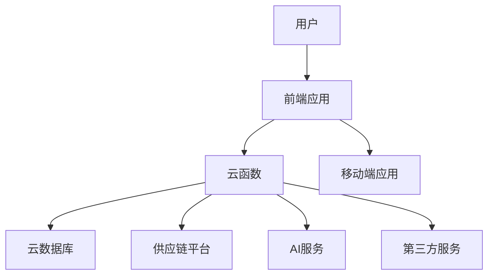

# 团餐中央厨房ERP系统分析与设计

## 一、系统分析

### 1. 业务背景

团餐中央厨房是为企业、学校、医院等团体提供餐饮服务的核心生产基地，具有规模化、标准化、流程化的特点。随着团餐行业的发展，传统的管理方式已无法满足企业的需求，需要一套高效、智能的ERP系统来提升管理水平和运营效率。

美江河餐饮生态系统作为市场领先的团餐管理系统，以"技术+供应链"双轮驱动为核心，为团餐企业提供全链条数字化解决方案。本系统设计基于美江河模式，结合vk-unicloud框架，构建一个适合团餐中央厨房的ERP系统。

### 2. 业务流程分析

#### 2.1 采购流程
- **AI预测需求**：基于历史数据和销售预测，智能预测原材料需求
- **生成采购计划**：根据预测需求和库存情况，生成采购计划
- **采购计划审批**：对采购计划进行审批
- **生成采购订单**：根据审批后的采购计划生成采购订单
- **供应链平台协同**：与供应商实时数据共享，实现供应链无缝对接
- **供应商确认**：供应商确认订单
- **到货验收**：对到货进行验收，包括数量、质量检查
- **采购入库**：验收合格后办理入库手续，更新库存
- **生成应付账款**：根据入库单和发票生成应付账款
- **付款**：财务部门根据应付账款进行付款

#### 2.2 生产流程
- **销售订单**：接收客户订单
- **AI智能排菜**：基于历史数据和营养搭配，智能生成菜单
- **生成生产计划**：根据订单和库存情况生成生产计划
- **生产计划审批**：对生产计划进行审批
- **生成生产任务**：根据生产计划生成生产任务
- **任务分配**：将生产任务分配给各个生产班组
- **生产执行**：按照标准工艺流程进行生产加工
- **质量检查**：对半成品和成品进行质量检查
- **成品入库**：生产完成后办理成品入库手续
- **生产完成**：完成生产任务

#### 2.3 销售流程
- **接收订单**：接收客户订单，包括菜品、数量、配送时间等信息
- **订单确认**：确认订单信息，包括价格、配送方式等
- **AI智能排菜**：基于客户需求和营养搭配，智能生成菜单
- **生成生产计划**：根据订单和库存情况生成生产计划
- **生产完成**：完成生产任务
- **生成配送单**：根据订单生成配送单
- **配送执行**：按照计划进行配送，确保按时送达
- **客户确认**：客户确认收到货物
- **生成应收账款**：根据配送单和发票生成应收账款
- **收款**：财务部门根据应收账款进行收款

#### 2.4 库存管理流程
- **采购入库**：原材料采购入库
- **生产领料**：生产部门领取原材料
- **生产入库**：生产完成后成品入库
- **销售出库**：销售产品出库
- **库存更新**：实时更新库存信息
- **库存监控**：实时监控库存水平
- **库存预警**：当库存低于安全库存时发出预警
- **AI预测需求**：基于历史数据和销售预测，智能预测需求
- **供应商协同**：与供应商实时数据共享，优化采购流程
- **定期盘点**：定期对库存进行盘点，确保账实相符
- **盘点差异处理**：处理盘点差异，调整库存

#### 2.5 财务管理流程
- **采购入库**：生成应付账款
- **销售出库**：生成应收账款
- **生产过程**：核算生产成本
- **收支管理**：记录收入和支出，分析利润情况
- **成本核算**：核算原材料成本、人工成本、设备成本等
- **财务报表**：生成资产负债表、利润表、现金流量表等
- **预算管理**：制定年度预算，监控预算执行情况

#### 2.6 人员管理流程
- **员工入职**：员工信息录入
- **员工信息管理**：维护员工基本信息、技能等级、培训记录等
- **考勤管理**：记录员工打卡、请假、加班等情况
- **绩效评估**：对员工工作表现进行评估，记录考核结果
- **薪资计算**：根据考勤记录和绩效评估结果计算员工工资
- **薪资发放**：发放员工工资
- **培训管理**：组织员工培训，记录培训结果

#### 2.7 质量管理流程
- **原材料采购**：采购原材料
- **原材料检验**：对采购的原材料进行质量检验
- **入库**：检验合格后入库
- **退货**：检验不合格的原材料退货
- **生产过程**：进行生产加工
- **生产过程监控**：监控生产过程中的质量控制
- **成品检测**：对成品进行质量检测
- **入库**：检测合格后入库
- **处理**：检测不合格的成品进行处理
- **销售出库**：销售产品出库
- **质量追溯**：对问题产品进行追溯
- **产品召回**：发现问题时进行产品召回
- **正常销售**：无问题产品正常销售
- **定期卫生检查**：定期对厨房、设备、人员进行卫生检查
- **卫生整改**：对卫生检查中发现的问题进行整改

### 3. 功能需求分析

#### 3.1 基础设置模块
- **企业信息管理**：
  - 管理公司基本信息，如名称、地址、联系方式等
  - 管理分支机构信息，如分公司、子公司等
  - 支持企业信息的添加、修改、删除、查询

- **用户权限管理**：
  - 管理用户账号，如添加、修改、删除、查询用户
  - 管理角色，如管理员、采购人员、生产人员、销售人员等
  - 分配角色权限，控制用户对系统功能的访问权限
  - 记录用户登录日志，追踪用户操作记录

- **系统参数设置**：
  - 设置系统基础配置，如系统名称、Logo、时区等
  - 设置业务规则，如采购审批流程、生产标准等
  - 支持参数的添加、修改、删除、查询

- **数据字典管理**：
  - 管理食材分类，如蔬菜、肉类、调料等
  - 管理菜品分类，如凉菜、热菜、汤类等
  - 管理计量单位，如千克、克、件等
  - 支持数据字典的添加、修改、删除、查询

#### 3.2 供应链管理模块（核心）
- **供应商管理**：
  - 管理供应商基本信息，如名称、地址、联系方式等
  - 对供应商进行评估，记录评估结果
  - 管理与供应商的合作历史，如采购记录、付款记录等
  - 支持供应商的添加、修改、删除、查询

- **采购计划**：
  - 基于AI预测的智能采购计划
  - 支持手动调整采购计划
  - 对采购计划进行审批
  - 支持采购计划的添加、修改、删除、查询

- **采购订单**：
  - 根据采购计划生成采购订单
  - 支持手动创建采购订单
  - 对采购订单进行审批
  - 跟踪采购订单的执行状态
  - 支持采购订单的添加、修改、删除、查询

- **采购入库**：
  - 对到货进行验收，记录验收结果
  - 对验收合格的原材料办理入库手续
  - 自动更新库存信息
  - 支持采购入库单的添加、修改、删除、查询

- **采购结算**：
  - 根据采购入库单和发票生成应付账款
  - 记录付款情况
  - 支持应付账款的添加、修改、删除、查询

- **供应链协同**：
  - 与供应商实时数据共享，实现供应链无缝对接
  - 供应商可以查看采购订单、库存需求等信息
  - 支持供应商在线确认订单、发货等操作

#### 3.3 库存管理模块
- **原材料库存**：
  - 实时监控原材料库存水平
  - 当库存低于安全库存时发出预警
  - 支持原材料的入库、出库、调拨操作
  - 支持原材料库存的查询、统计

- **半成品库存**：
  - 实时监控半成品库存水平
  - 支持半成品的入库、出库、调拨操作
  - 支持半成品库存的查询、统计

- **成品库存**：
  - 实时监控成品库存水平
  - 支持成品的入库、出库、调拨操作
  - 支持成品库存的查询、统计

- **库存盘点**：
  - 支持定期盘点，记录盘点结果
  - 处理盘点差异，调整库存
  - 生成盘点报表
  - 支持盘点单的添加、修改、删除、查询

- **库存报表**：
  - 生成库存周转率报表
  - 生成库存成本分析报表
  - 支持报表的导出、打印

#### 3.4 生产管理模块
- **生产计划**：
  - 根据订单和库存情况生成生产计划
  - 支持手动调整生产计划
  - 对生产计划进行审批
  - 支持生产计划的添加、修改、删除、查询

- **生产任务**：
  - 根据生产计划生成生产任务
  - 将生产任务分配给各个生产班组
  - 跟踪生产任务的执行进度
  - 记录生产任务的完成情况
  - 支持生产任务的添加、修改、删除、查询

- **加工工艺**：
  - 管理标准工艺流程，如切配、烹饪、包装等
  - 管理菜品配方，如原材料配比、制作方法等
  - 支持加工工艺和配方的添加、修改、删除、查询

- **AI智能排菜**：
  - 基于历史数据和营养搭配的智能排菜系统
  - 支持根据客户需求、季节变化、营养均衡等因素生成菜单
  - 支持菜单的调整和优化

- **生产报表**：
  - 生成生产效率报表，如产量、工时等
  - 生成生产成本分析报表
  - 支持报表的导出、打印

- **设备管理**：
  - 管理设备基本信息，如设备名称、型号、购买日期等
  - 记录设备状态，如运行、维护、故障等
  - 制定设备维护计划
  - 记录设备维护记录
  - 支持设备的添加、修改、删除、查询

#### 3.5 销售管理模块
- **客户管理**：
  - 管理客户基本信息，如名称、地址、联系方式等
  - 记录客户消费历史，如订单记录、付款记录等
  - 对客户进行信用评级
  - 支持客户的添加、修改、删除、查询

- **订单管理**：
  - 接收客户订单，记录订单信息
  - 对订单进行确认，包括价格、配送方式等
  - 处理订单变更，如数量、时间等
  - 跟踪订单的执行状态
  - 支持订单的添加、修改、删除、查询

- **配送管理**：
  - 根据订单和配送路线规划配送方案
  - 安排配送车辆和人员
  - 跟踪配送进度，确保按时送达
  - 记录配送结果
  - 支持配送单的添加、修改、删除、查询

- **销售结算**：
  - 根据配送单和发票生成应收账款
  - 记录收款情况
  - 支持应收账款的添加、修改、删除、查询

- **销售报表**：
  - 生成销售趋势报表，如销售额、销售量等
  - 生成客户分析报表，如客户分布、消费偏好等
  - 支持报表的导出、打印

#### 3.6 财务管理模块
- **成本核算**：
  - 核算原材料成本，如采购价格、损耗等
  - 核算人工成本，如工资、福利等
  - 核算设备成本，如折旧、维护等
  - 生成成本分析报表

- **收支管理**：
  - 记录收入，如销售收入、其他收入等
  - 记录支出，如采购支出、人工支出、设备支出等
  - 分析利润情况
  - 生成收支报表

- **财务报表**：
  - 生成资产负债表
  - 生成利润表
  - 生成现金流量表
  - 支持报表的导出、打印

- **预算管理**：
  - 制定年度预算，如收入预算、支出预算等
  - 监控预算执行情况，分析预算差异
  - 生成预算执行报表
  - 支持预算的添加、修改、删除、查询

#### 3.7 人员管理模块
- **员工信息**：
  - 管理员工基本信息，如姓名、性别、年龄、联系方式等
  - 记录员工技能等级，如厨师等级、配送员等级等
  - 记录员工培训记录，如培训内容、培训时间、培训结果等
  - 支持员工信息的添加、修改、删除、查询

- **考勤管理**：
  - 记录员工打卡记录，如上班时间、下班时间等
  - 管理员工请假记录，如请假类型、请假时间、请假原因等
  - 管理员工加班记录，如加班时间、加班原因等
  - 生成考勤报表
  - 支持考勤记录的添加、修改、删除、查询

- **薪资管理**：
  - 根据考勤记录和绩效评估结果计算员工工资
  - 记录工资发放情况
  - 生成薪资报表
  - 支持薪资记录的添加、修改、删除、查询

- **绩效评估**：
  - 对员工工作表现进行评估，记录考核结果
  - 生成绩效评估报表
  - 支持绩效评估记录的添加、修改、删除、查询

#### 3.8 质量管理模块
- **食品安全**：
  - 对采购的原材料进行质量检验，记录检验结果
  - 监控生产过程中的质量控制，记录监控结果
  - 对成品进行质量检测，记录检测结果
  - 生成食品安全报表
  - 支持检验记录的添加、修改、删除、查询

- **卫生检查**：
  - 定期对厨房、设备、人员进行卫生检查，记录检查结果
  - 生成卫生检查报表
  - 支持检查记录的添加、修改、删除、查询

- **质量追溯**：
  - 对问题产品进行追溯，查找问题原因
  - 记录产品召回情况
  - 生成质量追溯报表
  - 支持追溯记录的添加、修改、删除、查询

- **质量报表**：
  - 生成质量合格率报表
  - 生成质量问题分析报表
  - 支持报表的导出、打印

#### 3.9 数据分析模块（核心）
- **销售分析**：
  - 分析销售额、销售量等指标
  - 分析客户群体、消费偏好等
  - 分析销售趋势，预测未来销售情况
  - 生成销售分析报表

- **成本分析**：
  - 分析原材料成本、人工成本、运营成本等
  - 分析成本构成，找出成本控制的重点
  - 生成成本分析报表

- **生产分析**：
  - 分析生产效率、设备利用率、产能等指标
  - 分析生产瓶颈，优化生产流程
  - 生成生产分析报表

- **库存分析**：
  - 分析库存水平、周转率、滞销品等指标
  - 优化库存管理，减少库存积压
  - 生成库存分析报表

- **数据可视化**：
  - 实时数据看板，直观展示关键指标
  - 多维度数据展示，支持数据钻取
  - 支持自定义看板和报表

- **AI预测分析**：
  - 销售预测，基于历史数据预测未来销售情况
  - 库存预测，基于销售预测和当前库存预测未来库存需求
  - 成本预测，基于历史成本数据预测未来成本情况

- **自动报表生成**：
  - 智能生成各类业务报表，减少人工操作
  - 支持报表的定时生成和发送
  - 支持报表的自定义和定制

### 4. 非功能需求分析

#### 4.1 性能需求
- **响应时间**：系统响应时间不超过2秒
- **并发处理**：支持至少100个用户同时在线操作
- **数据处理**：能够处理大量数据，如历史订单、库存记录等

#### 4.2 安全需求
- **数据加密**：对敏感数据进行加密存储和传输
- **权限控制**：严格的用户权限管理，防止未授权访问
- **备份恢复**：定期备份数据，确保数据安全
- **审计日志**：记录用户操作日志，便于追溯

#### 4.3 可用性需求
- **系统可用性**：系统可用性达到99.9%
- **故障恢复**：当系统出现故障时，能够快速恢复
- **容灾备份**：建立容灾备份机制，确保业务连续性

#### 4.4 可扩展性需求
- **功能扩展**：支持功能模块的扩展和定制
- **性能扩展**：支持系统性能的横向扩展
- **集成扩展**：支持与其他系统的集成，如财务系统、CRM系统等

#### 4.5 易用性需求
- **界面设计**：简洁、直观的用户界面
- **操作流程**：符合业务操作习惯的流程设计
- **帮助文档**：提供详细的用户手册和在线帮助
- **培训支持**：提供系统操作培训

## 二、系统设计

### 1. 系统架构设计

#### 1.1 技术架构

基于vk-unicloud框架，采用前后端一体化开发模式，利用阿里云云函数和云数据库，实现快速部署和弹性扩展。结合美江河餐饮生态系统的"技术+供应链"双轮驱动模式，构建全链条数字化解决方案。

#### 1.2 系统分层

- **表现层**：前端应用和移动端应用，负责用户界面展示和交互
- **业务逻辑层**：云函数，负责业务逻辑处理
- **数据层**：云数据库，负责数据存储和管理
- **集成层**：与供应链平台、AI服务和第三方服务的集成

#### 1.3 核心组件

- **前端框架**：Vue.js，支持响应式设计
- **后端框架**：Node.js，基于云函数
- **数据库**：阿里云云数据库MongoDB
- **认证方式**：JWT认证
- **API设计**：RESTful API
- **数据缓存**：Redis
- **消息队列**：RabbitMQ
- **AI服务**：智能排菜、预测分析
- **供应链平台**：供应商管理、采购管理

### 2. 数据库设计

#### 2.1 数据库表结构

##### 2.1.1 基础设置模块

**企业信息表（enterprise）**
| 字段名 | 数据类型 | 描述 | 约束 |
| --- | --- | --- | --- |
| _id | ObjectId | 企业ID | 主键 |
| name | String | 企业名称 | 唯一，非空 |
| address | String | 企业地址 | 非空 |
| contact | String | 联系方式 | 非空 |
| logo | String | 企业Logo | - |
| createTime | Date | 创建时间 | 非空 |
| updateTime | Date | 更新时间 | 非空 |

**分支机构表（branch）**
| 字段名 | 数据类型 | 描述 | 约束 |
| --- | --- | --- | --- |
| _id | ObjectId | 分支机构ID | 主键 |
| enterpriseId | ObjectId | 企业ID | 外键 |
| name | String | 分支机构名称 | 非空 |
| address | String | 分支机构地址 | 非空 |
| contact | String | 联系方式 | 非空 |
| createTime | Date | 创建时间 | 非空 |
| updateTime | Date | 更新时间 | 非空 |

**用户表（user）**
| 字段名 | 数据类型 | 描述 | 约束 |
| --- | --- | --- | --- |
| _id | ObjectId | 用户ID | 主键 |
| username | String | 用户名 | 唯一，非空 |
| password | String | 密码 | 非空 |
| name | String | 姓名 | 非空 |
| roleId | ObjectId | 角色ID | 外键 |
| enterpriseId | ObjectId | 企业ID | 外键 |
| branchId | ObjectId | 分支机构ID | 外键 |
| createTime | Date | 创建时间 | 非空 |
| updateTime | Date | 更新时间 | 非空 |

**角色表（role）**
| 字段名 | 数据类型 | 描述 | 约束 |
| --- | --- | --- | --- |
| _id | ObjectId | 角色ID | 主键 |
| name | String | 角色名称 | 唯一，非空 |
| permissions | Array | 权限列表 | 非空 |
| createTime | Date | 创建时间 | 非空 |
| updateTime | Date | 更新时间 | 非空 |

**系统参数表（systemParam）**
| 字段名 | 数据类型 | 描述 | 约束 |
| --- | --- | --- | --- |
| _id | ObjectId | 参数ID | 主键 |
| key | String | 参数键 | 唯一，非空 |
| value | String | 参数值 | 非空 |
| description | String | 参数描述 | - |
| createTime | Date | 创建时间 | 非空 |
| updateTime | Date | 更新时间 | 非空 |

**数据字典表（dataDictionary）**
| 字段名 | 数据类型 | 描述 | 约束 |
| --- | --- | --- | --- |
| _id | ObjectId | 字典ID | 主键 |
| type | String | 字典类型 | 非空 |
| code | String | 字典编码 | 唯一，非空 |
| name | String | 字典名称 | 非空 |
| parentId | ObjectId | 父级ID | - |
| createTime | Date | 创建时间 | 非空 |
| updateTime | Date | 更新时间 | 非空 |

##### 2.1.2 供应链管理模块

**供应商表（supplier）**
| 字段名 | 数据类型 | 描述 | 约束 |
| --- | --- | --- | --- |
| _id | ObjectId | 供应商ID | 主键 |
| name | String | 供应商名称 | 唯一，非空 |
| address | String | 供应商地址 | 非空 |
| contact | String | 联系方式 | 非空 |
| evaluation | Number | 评估分数 | - |
| createTime | Date | 创建时间 | 非空 |
| updateTime | Date | 更新时间 | 非空 |

**采购计划表（purchasePlan）**
| 字段名 | 数据类型 | 描述 | 约束 |
| --- | --- | --- | --- |
| _id | ObjectId | 计划ID | 主键 |
| planCode | String | 计划编码 | 唯一，非空 |
| enterpriseId | ObjectId | 企业ID | 外键 |
| branchId | ObjectId | 分支机构ID | 外键 |
| status | String | 状态 | 非空 |
| totalAmount | Number | 总金额 | 非空 |
| createTime | Date | 创建时间 | 非空 |
| updateTime | Date | 更新时间 | 非空 |

**采购计划明细表（purchasePlanDetail）**
| 字段名 | 数据类型 | 描述 | 约束 |
| --- | --- | --- | --- |
| _id | ObjectId | 明细ID | 主键 |
| planId | ObjectId | 计划ID | 外键 |
| materialId | ObjectId | 原材料ID | 外键 |
| quantity | Number | 数量 | 非空 |
| unit | String | 单位 | 非空 |
| price | Number | 单价 | 非空 |
| amount | Number | 金额 | 非空 |
| createTime | Date | 创建时间 | 非空 |
| updateTime | Date | 更新时间 | 非空 |

**采购订单表（purchaseOrder）**
| 字段名 | 数据类型 | 描述 | 约束 |
| --- | --- | --- | --- |
| _id | ObjectId | 订单ID | 主键 |
| orderCode | String | 订单编码 | 唯一，非空 |
| supplierId | ObjectId | 供应商ID | 外键 |
| enterpriseId | ObjectId | 企业ID | 外键 |
| branchId | ObjectId | 分支机构ID | 外键 |
| status | String | 状态 | 非空 |
| totalAmount | Number | 总金额 | 非空 |
| createTime | Date | 创建时间 | 非空 |
| updateTime | Date | 更新时间 | 非空 |

**采购订单明细表（purchaseOrderDetail）**
| 字段名 | 数据类型 | 描述 | 约束 |
| --- | --- | --- | --- |
| _id | ObjectId | 明细ID | 主键 |
| orderId | ObjectId | 订单ID | 外键 |
| materialId | ObjectId | 原材料ID | 外键 |
| quantity | Number | 数量 | 非空 |
| unit | String | 单位 | 非空 |
| price | Number | 单价 | 非空 |
| amount | Number | 金额 | 非空 |
| createTime | Date | 创建时间 | 非空 |
| updateTime | Date | 更新时间 | 非空 |

**采购入库表（purchaseInbound）**
| 字段名 | 数据类型 | 描述 | 约束 |
| --- | --- | --- | --- |
| _id | ObjectId | 入库ID | 主键 |
| inboundCode | String | 入库编码 | 唯一，非空 |
| orderId | ObjectId | 订单ID | 外键 |
| supplierId | ObjectId | 供应商ID | 外键 |
| enterpriseId | ObjectId | 企业ID | 外键 |
| branchId | ObjectId | 分支机构ID | 外键 |
| status | String | 状态 | 非空 |
| totalAmount | Number | 总金额 | 非空 |
| createTime | Date | 创建时间 | 非空 |
| updateTime | Date | 更新时间 | 非空 |

**采购入库明细表（purchaseInboundDetail）**
| 字段名 | 数据类型 | 描述 | 约束 |
| --- | --- | --- | --- |
| _id | ObjectId | 明细ID | 主键 |
| inboundId | ObjectId | 入库ID | 外键 |
| materialId | ObjectId | 原材料ID | 外键 |
| quantity | Number | 数量 | 非空 |
| unit | String | 单位 | 非空 |
| price | Number | 单价 | 非空 |
| amount | Number | 金额 | 非空 |
| qualityStatus | String | 质量状态 | 非空 |
| createTime | Date | 创建时间 | 非空 |
| updateTime | Date | 更新时间 | 非空 |

**应付账款表（accountsPayable）**
| 字段名 | 数据类型 | 描述 | 约束 |
| --- | --- | --- | --- |
| _id | ObjectId | 应付ID | 主键 |
| code | String | 应付编码 | 唯一，非空 |
| supplierId | ObjectId | 供应商ID | 外键 |
| enterpriseId | ObjectId | 企业ID | 外键 |
| branchId | ObjectId | 分支机构ID | 外键 |
| amount | Number | 金额 | 非空 |
| paidAmount | Number | 已付金额 | 非空 |
| status | String | 状态 | 非空 |
| createTime | Date | 创建时间 | 非空 |
| updateTime | Date | 更新时间 | 非空 |

**供应链协同表（supplyChainCollaboration）**
| 字段名 | 数据类型 | 描述 | 约束 |
| --- | --- | --- | --- |
| _id | ObjectId | 协同ID | 主键 |
| code | String | 协同编码 | 唯一，非空 |
| supplierId | ObjectId | 供应商ID | 外键 |
| enterpriseId | ObjectId | 企业ID | 外键 |
| branchId | ObjectId | 分支机构ID | 外键 |
| type | String | 协同类型 | 非空 |
| content | Object | 协同内容 | 非空 |
| status | String | 状态 | 非空 |
| createTime | Date | 创建时间 | 非空 |
| updateTime | Date | 更新时间 | 非空 |

##### 2.1.3 库存管理模块

**原材料表（material）**
| 字段名 | 数据类型 | 描述 | 约束 |
| --- | --- | --- | --- |
| _id | ObjectId | 原材料ID | 主键 |
| code | String | 原材料编码 | 唯一，非空 |
| name | String | 原材料名称 | 非空 |
| categoryId | ObjectId | 分类ID | 外键 |
| unit | String | 单位 | 非空 |
| safetyStock | Number | 安全库存 | 非空 |
| currentStock | Number | 当前库存 | 非空 |
| createTime | Date | 创建时间 | 非空 |
| updateTime | Date | 更新时间 | 非空 |

**半成品表（semiProduct）**
| 字段名 | 数据类型 | 描述 | 约束 |
| --- | --- | --- | --- |
| _id | ObjectId | 半成品ID | 主键 |
| code | String | 半成品编码 | 唯一，非空 |
| name | String | 半成品名称 | 非空 |
| categoryId | ObjectId | 分类ID | 外键 |
| unit | String | 单位 | 非空 |
| currentStock | Number | 当前库存 | 非空 |
| createTime | Date | 创建时间 | 非空 |
| updateTime | Date | 更新时间 | 非空 |

**成品表（product）**
| 字段名 | 数据类型 | 描述 | 约束 |
| --- | --- | --- | --- |
| _id | ObjectId | 成品ID | 主键 |
| code | String | 成品编码 | 唯一，非空 |
| name | String | 成品名称 | 非空 |
| categoryId | ObjectId | 分类ID | 外键 |
| unit | String | 单位 | 非空 |
| currentStock | Number | 当前库存 | 非空 |
| createTime | Date | 创建时间 | 非空 |
| updateTime | Date | 更新时间 | 非空 |

**库存变动表（inventoryChange）**
| 字段名 | 数据类型 | 描述 | 约束 |
| --- | --- | --- | --- |
| _id | ObjectId | 变动ID | 主键 |
| type | String | 变动类型 | 非空 |
| targetType | String | 目标类型 | 非空 |
| targetId | ObjectId | 目标ID | 外键 |
| quantity | Number | 数量 | 非空 |
| unit | String | 单位 | 非空 |
| balance | Number | 余额 | 非空 |
| referenceId | ObjectId | 参考ID | 外键 |
| enterpriseId | ObjectId | 企业ID | 外键 |
| branchId | ObjectId | 分支机构ID | 外键 |
| createTime | Date | 创建时间 | 非空 |

**库存盘点表（inventoryCheck）**
| 字段名 | 数据类型 | 描述 | 约束 |
| --- | --- | --- | --- |
| _id | ObjectId | 盘点ID | 主键 |
| checkCode | String | 盘点编码 | 唯一，非空 |
| enterpriseId | ObjectId | 企业ID | 外键 |
| branchId | ObjectId | 分支机构ID | 外键 |
| status | String | 状态 | 非空 |
| createTime | Date | 创建时间 | 非空 |
| updateTime | Date | 更新时间 | 非空 |

**库存盘点明细表（inventoryCheckDetail）**
| 字段名 | 数据类型 | 描述 | 约束 |
| --- | --- | --- | --- |
| _id | ObjectId | 明细ID | 主键 |
| checkId | ObjectId | 盘点ID | 外键 |
| targetType | String | 目标类型 | 非空 |
| targetId | ObjectId | 目标ID | 外键 |
| systemQuantity | Number | 系统数量 | 非空 |
| actualQuantity | Number | 实际数量 | 非空 |
| difference | Number | 差异数量 | 非空 |
| createTime | Date | 创建时间 | 非空 |
| updateTime | Date | 更新时间 | 非空 |

##### 2.1.4 生产管理模块

**生产计划表（productionPlan）**
| 字段名 | 数据类型 | 描述 | 约束 |
| --- | --- | --- | --- |
| _id | ObjectId | 计划ID | 主键 |
| planCode | String | 计划编码 | 唯一，非空 |
| enterpriseId | ObjectId | 企业ID | 外键 |
| branchId | ObjectId | 分支机构ID | 外键 |
| status | String | 状态 | 非空 |
| totalQuantity | Number | 总数量 | 非空 |
| createTime | Date | 创建时间 | 非空 |
| updateTime | Date | 更新时间 | 非空 |

**生产计划明细表（productionPlanDetail）**
| 字段名 | 数据类型 | 描述 | 约束 |
| --- | --- | --- | --- |
| _id | ObjectId | 明细ID | 主键 |
| planId | ObjectId | 计划ID | 外键 |
| productId | ObjectId | 成品ID | 外键 |
| quantity | Number | 数量 | 非空 |
| unit | String | 单位 | 非空 |
| createTime | Date | 创建时间 | 非空 |
| updateTime | Date | 更新时间 | 非空 |

**生产任务表（productionTask）**
| 字段名 | 数据类型 | 描述 | 约束 |
| --- | --- | --- | --- |
| _id | ObjectId | 任务ID | 主键 |
| taskCode | String | 任务编码 | 唯一，非空 |
| planId | ObjectId | 计划ID | 外键 |
| enterpriseId | ObjectId | 企业ID | 外键 |
| branchId | ObjectId | 分支机构ID | 外键 |
| status | String | 状态 | 非空 |
| assignTo | ObjectId | 分配给 | 外键 |
| createTime | Date | 创建时间 | 非空 |
| updateTime | Date | 更新时间 | 非空 |

**生产任务明细表（productionTaskDetail）**
| 字段名 | 数据类型 | 描述 | 约束 |
| --- | --- | --- | --- |
| _id | ObjectId | 明细ID | 主键 |
| taskId | ObjectId | 任务ID | 外键 |
| productId | ObjectId | 成品ID | 外键 |
| quantity | Number | 数量 | 非空 |
| unit | String | 单位 | 非空 |
| completedQuantity | Number | 完成数量 | 非空 |
| createTime | Date | 创建时间 | 非空 |
| updateTime | Date | 更新时间 | 非空 |

**加工工艺表（process）**
| 字段名 | 数据类型 | 描述 | 约束 |
| --- | --- | --- | --- |
| _id | ObjectId | 工艺ID | 主键 |
| code | String | 工艺编码 | 唯一，非空 |
| name | String | 工艺名称 | 非空 |
| description | String | 工艺描述 | - |
| steps | Array | 工艺步骤 | 非空 |
| createTime | Date | 创建时间 | 非空 |
| updateTime | Date | 更新时间 | 非空 |

**配方表（recipe）**
| 字段名 | 数据类型 | 描述 | 约束 |
| --- | --- | --- | --- |
| _id | ObjectId | 配方ID | 主键 |
| code | String | 配方编码 | 唯一，非空 |
| name | String | 配方名称 | 非空 |
| productId | ObjectId | 成品ID | 外键 |
| processId | ObjectId | 工艺ID | 外键 |
| createTime | Date | 创建时间 | 非空 |
| updateTime | Date | 更新时间 | 非空 |

**配方明细表（recipeDetail）**
| 字段名 | 数据类型 | 描述 | 约束 |
| --- | --- | --- | --- |
| _id | ObjectId | 明细ID | 主键 |
| recipeId | ObjectId | 配方ID | 外键 |
| materialId | ObjectId | 原材料ID | 外键 |
| quantity | Number | 数量 | 非空 |
| unit | String | 单位 | 非空 |
| createTime | Date | 创建时间 | 非空 |
| updateTime | Date | 更新时间 | 非空 |

**AI智能排菜表（aiMenu）**
| 字段名 | 数据类型 | 描述 | 约束 |
| --- | --- | --- | --- |
| _id | ObjectId | 排菜ID | 主键 |
| code | String | 排菜编码 | 唯一，非空 |
| name | String | 排菜名称 | 非空 |
| enterpriseId | ObjectId | 企业ID | 外键 |
| branchId | ObjectId | 分支机构ID | 外键 |
| menuItems | Array | 菜单项目 | 非空 |
| nutritionInfo | Object | 营养信息 | 非空 |
| createTime | Date | 创建时间 | 非空 |
| updateTime | Date | 更新时间 | 非空 |

**设备表（equipment）**
| 字段名 | 数据类型 | 描述 | 约束 |
| --- | --- | --- | --- |
| _id | ObjectId | 设备ID | 主键 |
| code | String | 设备编码 | 唯一，非空 |
| name | String | 设备名称 | 非空 |
| model | String | 设备型号 | 非空 |
| status | String | 设备状态 | 非空 |
| purchaseDate | Date | 购买日期 | 非空 |
| enterpriseId | ObjectId | 企业ID | 外键 |
| branchId | ObjectId | 分支机构ID | 外键 |
| createTime | Date | 创建时间 | 非空 |
| updateTime | Date | 更新时间 | 非空 |

**设备维护表（equipmentMaintenance）**
| 字段名 | 数据类型 | 描述 | 约束 |
| --- | --- | --- | --- |
| _id | ObjectId | 维护ID | 主键 |
| code | String | 维护编码 | 唯一，非空 |
| equipmentId | ObjectId | 设备ID | 外键 |
| maintenanceType | String | 维护类型 | 非空 |
| maintenanceDate | Date | 维护日期 | 非空 |
| status | String | 状态 | 非空 |
| createTime | Date | 创建时间 | 非空 |
| updateTime | Date | 更新时间 | 非空 |

##### 2.1.5 销售管理模块

**客户表（customer）**
| 字段名 | 数据类型 | 描述 | 约束 |
| --- | --- | --- | --- |
| _id | ObjectId | 客户ID | 主键 |
| code | String | 客户编码 | 唯一，非空 |
| name | String | 客户名称 | 非空 |
| address | String | 客户地址 | 非空 |
| contact | String | 联系方式 | 非空 |
| creditRating | String | 信用评级 | - |
| enterpriseId | ObjectId | 企业ID | 外键 |
| createTime | Date | 创建时间 | 非空 |
| updateTime | Date | 更新时间 | 非空 |

**销售订单表（salesOrder）**
| 字段名 | 数据类型 | 描述 | 约束 |
| --- | --- | --- | --- |
| _id | ObjectId | 订单ID | 主键 |
| orderCode | String | 订单编码 | 唯一，非空 |
| customerId | ObjectId | 客户ID | 外键 |
| enterpriseId | ObjectId | 企业ID | 外键 |
| branchId | ObjectId | 分支机构ID | 外键 |
| status | String | 状态 | 非空 |
| totalAmount | Number | 总金额 | 非空 |
| deliveryTime | Date | 配送时间 | 非空 |
| createTime | Date | 创建时间 | 非空 |
| updateTime | Date | 更新时间 | 非空 |

**销售订单明细表（salesOrderDetail）**
| 字段名 | 数据类型 | 描述 | 约束 |
| --- | --- | --- | --- |
| _id | ObjectId | 明细ID | 主键 |
| orderId | ObjectId | 订单ID | 外键 |
| productId | ObjectId | 成品ID | 外键 |
| quantity | Number | 数量 | 非空 |
| unit | String | 单位 | 非空 |
| price | Number | 单价 | 非空 |
| amount | Number | 金额 | 非空 |
| createTime | Date | 创建时间 | 非空 |
| updateTime | Date | 更新时间 | 非空 |

**配送表（delivery）**
| 字段名 | 数据类型 | 描述 | 约束 |
| --- | --- | --- | --- |
| _id | ObjectId | 配送ID | 主键 |
| deliveryCode | String | 配送编码 | 唯一，非空 |
| orderId | ObjectId | 订单ID | 外键 |
| customerId | ObjectId | 客户ID | 外键 |
| enterpriseId | ObjectId | 企业ID | 外键 |
| branchId | ObjectId | 分支机构ID | 外键 |
| status | String | 状态 | 非空 |
| vehicleId | ObjectId | 车辆ID | 外键 |
| driverId | ObjectId | 司机ID | 外键 |
| createTime | Date | 创建时间 | 非空 |
| updateTime | Date | 更新时间 | 非空 |

**配送明细表（deliveryDetail）**
| 字段名 | 数据类型 | 描述 | 约束 |
| --- | --- | --- | --- |
| _id | ObjectId | 明细ID | 主键 |
| deliveryId | ObjectId | 配送ID | 外键 |
| productId | ObjectId | 成品ID | 外键 |
| quantity | Number | 数量 | 非空 |
| unit | String | 单位 | 非空 |
| createTime | Date | 创建时间 | 非空 |
| updateTime | Date | 更新时间 | 非空 |

**应收账款表（accountsReceivable）**
| 字段名 | 数据类型 | 描述 | 约束 |
| --- | --- | --- | --- |
| _id | ObjectId | 应收ID | 主键 |
| code | String | 应收编码 | 唯一，非空 |
| customerId | ObjectId | 客户ID | 外键 |
| enterpriseId | ObjectId | 企业ID | 外键 |
| branchId | ObjectId | 分支机构ID | 外键 |
| amount | Number | 金额 | 非空 |
| receivedAmount | Number | 已收金额 | 非空 |
| status | String | 状态 | 非空 |
| createTime | Date | 创建时间 | 非空 |
| updateTime | Date | 更新时间 | 非空 |

##### 2.1.6 财务管理模块

**成本核算表（costAccounting）**
| 字段名 | 数据类型 | 描述 | 约束 |
| --- | --- | --- | --- |
| _id | ObjectId | 核算ID | 主键 |
| code | String | 核算编码 | 唯一，非空 |
| enterpriseId | ObjectId | 企业ID | 外键 |
| branchId | ObjectId | 分支机构ID | 外键 |
| period | String | 核算期间 | 非空 |
| materialCost | Number | 原材料成本 | 非空 |
| laborCost | Number | 人工成本 | 非空 |
| equipmentCost | Number | 设备成本 | 非空 |
| otherCost | Number | 其他成本 | 非空 |
| totalCost | Number | 总成本 | 非空 |
| createTime | Date | 创建时间 | 非空 |
| updateTime | Date | 更新时间 | 非空 |

**收支记录表（incomeExpense）**
| 字段名 | 数据类型 | 描述 | 约束 |
| --- | --- | --- | --- |
| _id | ObjectId | 记录ID | 主键 |
| code | String | 记录编码 | 唯一，非空 |
| enterpriseId | ObjectId | 企业ID | 外键 |
| branchId | ObjectId | 分支机构ID | 外键 |
| type | String | 类型 | 非空 |
| amount | Number | 金额 | 非空 |
| description | String | 描述 | - |
| createTime | Date | 创建时间 | 非空 |
| updateTime | Date | 更新时间 | 非空 |

**财务报表表（financialStatement）**
| 字段名 | 数据类型 | 描述 | 约束 |
| --- | --- | --- | --- |
| _id | ObjectId | 报表ID | 主键 |
| code | String | 报表编码 | 唯一，非空 |
| enterpriseId | ObjectId | 企业ID | 外键 |
| branchId | ObjectId | 分支机构ID | 外键 |
| type | String | 报表类型 | 非空 |
| period | String | 报表期间 | 非空 |
| content | Object | 报表内容 | 非空 |
| createTime | Date | 创建时间 | 非空 |
| updateTime | Date | 更新时间 | 非空 |

**预算表（budget）**
| 字段名 | 数据类型 | 描述 | 约束 |
| --- | --- | --- | --- |
| _id | ObjectId | 预算ID | 主键 |
| code | String | 预算编码 | 唯一，非空 |
| enterpriseId | ObjectId | 企业ID | 外键 |
| branchId | ObjectId | 分支机构ID | 外键 |
| year | Number | 预算年份 | 非空 |
| incomeBudget | Number | 收入预算 | 非空 |
| expenseBudget | Number | 支出预算 | 非空 |
| createTime | Date | 创建时间 | 非空 |
| updateTime | Date | 更新时间 | 非空 |

**预算执行表（budgetExecution）**
| 字段名 | 数据类型 | 描述 | 约束 |
| --- | --- | --- | --- |
| _id | ObjectId | 执行ID | 主键 |
| budgetId | ObjectId | 预算ID | 外键 |
| period | String | 执行期间 | 非空 |
| actualIncome | Number | 实际收入 | 非空 |
| actualExpense | Number | 实际支出 | 非空 |
| createTime | Date | 创建时间 | 非空 |
| updateTime | Date | 更新时间 | 非空 |

##### 2.1.7 人员管理模块

**员工表（employee）**
| 字段名 | 数据类型 | 描述 | 约束 |
| --- | --- | --- | --- |
| _id | ObjectId | 员工ID | 主键 |
| code | String | 员工编码 | 唯一，非空 |
| name | String | 姓名 | 非空 |
| gender | String | 性别 | 非空 |
| age | Number | 年龄 | 非空 |
| contact | String | 联系方式 | 非空 |
| skillLevel | String | 技能等级 | - |
| enterpriseId | ObjectId | 企业ID | 外键 |
| branchId | ObjectId | 分支机构ID | 外键 |
| createTime | Date | 创建时间 | 非空 |
| updateTime | Date | 更新时间 | 非空 |

**培训记录表（trainingRecord）**
| 字段名 | 数据类型 | 描述 | 约束 |
| --- | --- | --- | --- |
| _id | ObjectId | 记录ID | 主键 |
| employeeId | ObjectId | 员工ID | 外键 |
| trainingContent | String | 培训