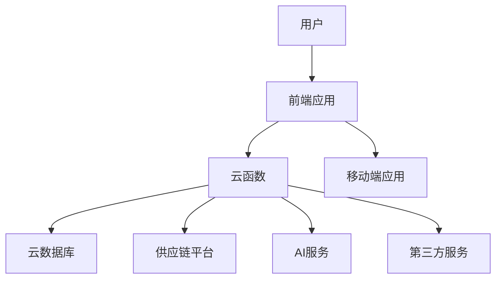
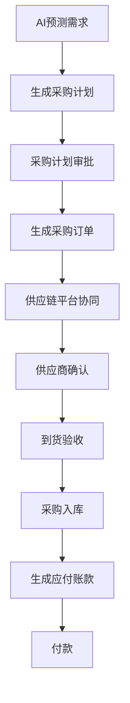
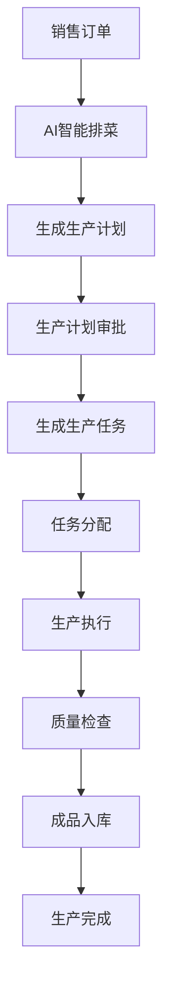
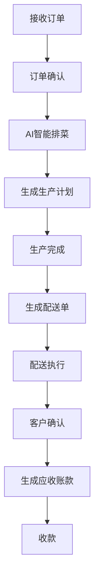
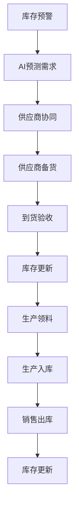

# 团餐中央厨房ERP系统设计 - 美江河模式

## 一、系统架构设计

### 1. 技术架构

基于vk-unicloud框架，采用前后端一体化开发模式，利用阿里云云函数和云数据库，实现快速部署和弹性扩展。结合美江河餐饮生态系统的"技术+供应链"双轮驱动模式，构建全链条数字化解决方案。

### 2. 系统分层

- **表现层**：前端应用和移动端应用，负责用户界面展示和交互
- **业务逻辑层**：云函数，负责业务逻辑处理
- **数据层**：云数据库，负责数据存储和管理
- **集成层**：与供应链平台、AI服务和第三方服务的集成

### 3. 核心组件

- **前端框架**：Vue.js，支持响应式设计
- **后端框架**：Node.js，基于云函数
- **数据库**：阿里云云数据库MongoDB
- **认证方式**：JWT认证
- **API设计**：RESTful API
- **数据缓存**：Redis
- **消息队列**：RabbitMQ
- **AI服务**：智能排菜、预测分析
- **供应链平台**：供应商管理、采购管理

## 二、核心功能模块

### 1. 基础设置模块
- **企业信息管理**：公司基本信息、分支机构管理
- **用户权限管理**：角色分配、权限设置、登录日志
- **系统参数设置**：基础配置、业务规则设置
- **数据字典管理**：食材分类、菜品分类、计量单位等

### 2. 供应链管理模块（核心）
- **供应商管理**：供应商信息、评估、合作历史
- **采购计划**：基于AI预测的智能采购计划
- **采购订单**：订单创建、审批、跟踪
- **采购入库**：入库验收、质量检查、库存更新
- **采购结算**：应付账款、发票管理
- **供应链协同**：与供应商实时数据共享，实现供应链无缝对接

### 3. 库存管理模块
- **原材料库存**：实时库存、库存预警、库存调拨
- **半成品库存**：加工过程中的半成品种类和数量
- **成品库存**：完成品的存储和管理
- **库存盘点**：定期盘点、差异处理
- **库存报表**：库存周转率、库存成本分析

### 4. 生产管理模块
- **生产计划**：根据订单和库存生成生产计划
- **生产任务**：任务分配、进度跟踪、完成确认
- **加工工艺**：标准工艺流程、配方管理
- **AI智能排菜**：基于历史数据和营养搭配的智能排菜系统
- **生产报表**：生产效率、成本分析
- **设备管理**：设备状态、维护计划

### 5. 销售管理模块
- **客户管理**：客户信息、消费历史、信用评级
- **订单管理**：订单接收、确认、变更
- **配送管理**：配送路线规划、车辆调度、配送跟踪
- **销售结算**：应收账款、发票管理
- **销售报表**：销售趋势、客户分析

### 6. 财务管理模块
- **成本核算**：原材料成本、人工成本、设备成本
- **收支管理**：收入、支出、利润分析
- **财务报表**：资产负债表、利润表、现金流量表
- **预算管理**：年度预算、预算执行分析

### 7. 人员管理模块
- **员工信息**：基本信息、技能等级、培训记录
- **考勤管理**：打卡记录、请假管理、加班管理
- **薪资管理**：工资计算、发放记录
- **绩效评估**：工作表现、考核结果

### 8. 质量管理模块
- **食品安全**：原材料检验、生产过程监控、成品检测
- **卫生检查**：厨房卫生、设备卫生、人员卫生
- **质量追溯**：问题产品追溯、召回管理
- **质量报表**：质量合格率、问题分析

### 9. 数据分析模块（核心）
- **销售分析**：销售额、客户群体、销售趋势
- **成本分析**：原材料成本、人工成本、运营成本
- **生产分析**：生产效率、设备利用率、产能分析
- **库存分析**：库存水平、周转率、滞销品分析
- **数据可视化**：实时数据看板、多维度数据展示
- **AI预测分析**：销售预测、库存预测、成本预测
- **自动报表生成**：智能生成各类业务报表

## 三、技术特点

1. **技术+供应链双轮驱动**：结合先进技术和供应链管理，实现全链条数字化
2. **AI智能应用**：AI智能排菜、预测分析，提高决策效率
3. **供应链无缝对接**：与供应商实时数据共享，优化采购流程
4. **数据实时可视化**：实时监控业务数据，直观展示关键指标
5. **自动报表生成**：智能生成各类业务报表，减少人工操作
6. **前后端一体化**：前端使用Vue.js，后端使用Node.js，开发效率高
7. **移动端支持**：适配手机和平板，方便现场操作
8. **安全可靠**：数据加密、权限控制、备份恢复

## 四、系统流程设计

### 1. 采购流程

### 2. 生产流程

### 3. 销售流程

### 4. 供应链协同流程

## 五、系统安全设计

### 1. 认证与授权
- **JWT认证**：使用JSON Web Token进行身份认证
- **角色权限管理**：基于角色的访问控制（RBAC）
- **细粒度权限**：对每个功能模块和操作进行权限控制
- **密码加密**：用户密码使用bcrypt等算法加密存储

### 2. 数据安全
- **数据加密**：敏感数据加密存储和传输
- **数据备份**：定期备份数据，确保数据安全
- **数据隔离**：不同企业的数据相互隔离
- **审计日志**：记录用户操作日志，便于追溯

### 3. 网络安全
- **HTTPS**：使用HTTPS协议加密传输数据
- **防火墙**：配置防火墙，防止恶意攻击
- **入侵检测**：部署入侵检测系统，及时发现和处理安全威胁
- **DDoS防护**：防止分布式拒绝服务攻击

## 六、系统部署与运维

### 1. 部署方案
- **阿里云部署**：部署在阿里云服务器上
- **容器化**：使用Docker容器化部署，便于管理和扩展
- **CI/CD**：配置持续集成和持续部署流程，自动化部署

### 2. 运维管理
- **监控系统**：部署监控系统，实时监控系统运行状态
- **日志管理**：集中管理系统日志，便于问题排查
- **告警机制**：设置告警阈值，及时发现和处理问题
- **备份恢复**：定期备份数据，制定恢复方案

### 3. 性能优化
- **数据库优化**：合理设计索引，优化查询语句
- **缓存策略**：使用Redis缓存热点数据，提高系统响应速度
- **负载均衡**：配置负载均衡，分散系统压力
- **代码优化**：优化代码结构，提高代码执行效率

## 七、总结

本系统设计基于美江河餐饮生态系统的核心特点，结合vk-unicloud框架，构建了一个以"技术+供应链"双轮驱动的团餐中央厨房ERP系统。系统涵盖了采购、生产、销售、库存、财务、人员、质量等各个方面，并集成了AI智能排菜、供应链无缝对接、数据实时可视化、自动报表生成等核心功能。

系统具备良好的性能、安全性、可用性、可扩展性和易用性，能够满足团餐企业的数字化转型需求，提高运营效率，降低运营成本，提升产品质量，增强决策能力，提升客户满意度。

本设计文档为后续的系统开发和实施提供了详细的指导，确保系统能够按照预期目标实现。